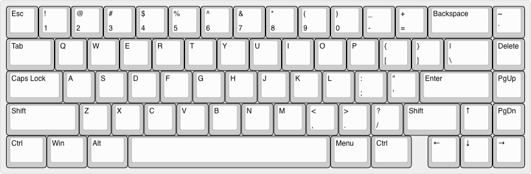

# VR67-Keyboard-PCB

## Intent

***This is a long intent idea - not lilely to start soon!***

A 67-key "65%" keyboard designed for QMK with specific focus on Topre / EC *(Electro Capacitive)* switches.

## Ideation

Ah.... Topre!  The much wanted, but highly niche, keyboards.  Only a few on the market, and most of thoes are ABS cases.

This will be an attempt to build a Alu case topre-style keyboard.

**The problem is...**

... that "Topre" switches aren't commercially available for self-built projects.

Things are changing tho., it may be somewhat possible with buying "spare parts" for the existing sets - things like:

- [Switch Housing](https://aliexpress.com/item/1005005724051113.html)
- [Dome Springs](https://aliexpress.com/item/1005007038852089.html)
- Switch Sliders, [1](https://aliexpress.com/item/1005007476122176.html) & [2](https://aliexpress.com/item/1005005721976294.html)
- Rubber Domes, [1](https://aliexpress.com/item/1005006621069216.html) & [2](https://aliexpress.com/item/1005005721050116.html)
- [Stabs](https://aliexpress.com/item/1005006631414158.html) *(a.k.a. "Sliders Stems Adapters")*

## Planned Features

- [ ] ... by the time I get this started the whole MCU landscape may have changed ;)  
We'll see.

&nbsp; &nbsp;
---
Made with &#9829; by **Vino Rodrigues**
